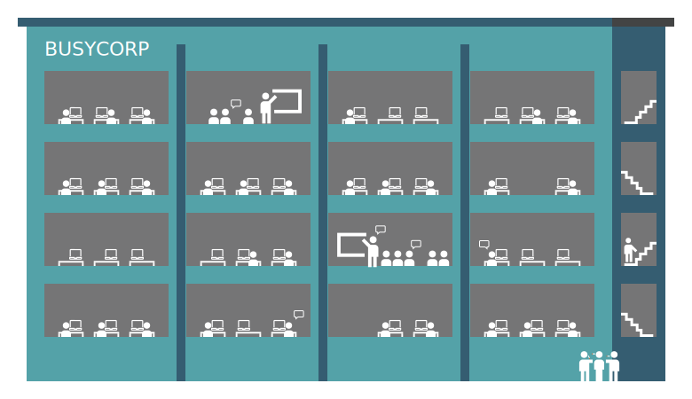

# Formatting Guide: Markdown

This is the style guide for the Markdown as it may be used with the MARKUP theme.

```eval_rst
* :ref:`admonitions`
* :ref:`card-walls`
* :ref:`code-blocks`
* :ref:`content-tabs`
* :ref:`expandos`
* :ref:`font-awesome`
* :ref:`header-levels`
* :ref:`header-markup-length`
* :ref:`horizontal-rule`
* :ref:`images`
* :ref:`includes`
* :ref:`inline-markup`
* :ref:`links`
* :ref:`lists`
* :ref:`raw-html`
* :ref:`tables`
* :ref:`toctree`
* :ref:`topic-titles`
* :ref:`unsupported`
* :ref:`additional-resources`
```


## Markdown for Sphinx

Using Markdown with Sphinx requires the Recommonmark plugin, which enables authoring in Markdown using the CommonMark specification of Markdown. (Only the CommonMark specification of Markdown is supported by the MARKUP theme.) The Recommonmark plugin enables the ability to use Markdown *and* Sphinx directive formatting within the same file, which opens up to Markdown-based topics some of the more powerful aspects of Sphinx content management.

To enable the use of Markdown with a Sphinx documentation project, install the Recommonmark plugin, and then adjust your Sphinx project's configuration file.

First install Recommonmark:

```console
pip install commonmark recommonmark
```

In the project's `conf.py` files, add the following at the top under `import sys, os`:

```python
from recommonmark.parser import CommonMarkParser
from recommonmark.transform import AutoStructify

source_parsers = {
    '.md': CommonMarkParser,
}
```

and then change:

```python
source_suffix = '.rst'
```

to:

```python
source_suffix = ['.rst', '.md']
```

At the bottom of the `Options for HTML output` configuration section, add:

```python
def setup(app):
app.add_config_value('recommonmark_config', {
  'enable_eval_rst': True,
}, True)
app.add_transform(AutoStructify)
```

### Evaluate reStructuredText

Configuring Remarkdown enables the use of the `eval_rst`, which creates a bridge from Markdown that allows standard reStructuredText processing, including the use of directives. For example:

~~~
```eval_rst
.. note:: This is the note directive in a Markdown topic. Naming the code block `eval_rst` allows the contents of that code block to be processed as if it were reStructuredText despite being in a Markdown file. Pretty cool!
```
~~~

builds as:

```eval_rst
.. note:: This is the note directive in a Markdown topic. Naming the code block `eval_rst` allows the contents of that code block to be processed as if it were reStructuredText despite being in a Markdown file. Pretty cool!
```


```eval_rst
.. _admonitions:
```

## Admonitions

Admonitions are notes and warnings. Use notes for a simple callout and warnings for things that will break if not followed correctly. Use the others sparingly, or at least in a consistent manner.

You can apply the same admonition styles as reStructuredText by using raw HTML or by using a Sphinx directive.

### Attention

Attentions can be added via raw HTML in Markdown or via a Sphinx directive.

**Raw HTML**

```html
<div class="admonition attention">
<p class="first admonition-title">Attention</p>
<p class="last">The text for the attention built from raw HTML.</p>
</div>
```

builds as:

<div class="admonition attention">
<p class="first admonition-title">Attention</p>
<p class="last">The text for the attention built from raw HTML.</p>
</div>

**Sphinx directive**

~~~
```eval_rst
.. attention:: This is the text for the attention built from a directive.
```
~~~

builds as:

```eval_rst
.. attention:: This is the text for the attention built from a directive.
```

### Caution

Cautions can be added via raw HTML in Markdown or via a Sphinx directive.

**Raw HTML**

```html
<div class="admonition caution">
<p class="first admonition-title">Caution</p>
<p class="last">The text for the caution built from raw HTML.</p>
</div>
```

builds as:

<div class="admonition caution">
<p class="first admonition-title">Caution</p>
<p class="last">The text for the caution built from raw HTML.</p>
</div>

**Sphinx directive**

~~~
```eval_rst
.. caution:: This is the text for the caution built from a directive.
```
~~~

builds as:

```eval_rst
.. caution:: This is the text for the caution built from a directive.
```

### Custom Admonitions

This theme uses the default admonition to enable the use of custom titles. The default admonition is styled the same as a note.

**Raw HTML**

A custom admonition may be defined using raw HTML. Change the admonition title to what you want it to say.

```html
<div class="admonition custom">
<p class="first admonition-title">Custom admonition</p>
<p class="last">Contents of custom admonition.</p>
</div>
```

builds as:

<div class="admonition custom">
<p class="first admonition-title">Custom admonition</p>
<p class="last">Contents of custom admonition!</p>
</div>

**Sphinx directive**

~~~
```eval_rst
.. code-block:: none

   .. admonition:: Custom admonition

      Contents of custom admonition!
```
~~~

Which will appear in the documentation like this:

```eval_rst
.. admonition:: Custom admonition

   Contents of custom admonition!
```


### Danger

Danger can be added via raw HTML in Markdown or via a Sphinx directive.

**Raw HTML**

```html
<div class="admonition danger">
<p class="first admonition-title">Danger</p>
<p class="last">The text for the danger built from raw HTML.</p>
</div>
```

builds as:

<div class="admonition danger">
<p class="first admonition-title">Danger</p>
<p class="last">The text for the danger built from raw HTML.</p>
</div>

**Sphinx directive**

~~~
```eval_rst
.. danger:: This is the text for the danger built from a directive.
```
~~~

builds as:

```eval_rst
.. danger:: This is the text for the danger built from a directive.
```

### Error

Error can be added via raw HTML in Markdown or via a Sphinx directive.

**Raw HTML**

```html
<div class="admonition error">
<p class="first admonition-title">Error</p>
<p class="last">The text for the error built from raw HTML.</p>
</div>
```

builds as:

<div class="admonition error">
<p class="first admonition-title">Error</p>
<p class="last">The text for the error built from raw HTML.</p>
</div>

**Sphinx directive**

~~~
```eval_rst
.. error:: This is the text for the error built from a directive.
```
~~~

builds as:

```eval_rst
.. error:: This is the text for the error built from a directive.
```

### Hint

Hints can be added via raw HTML in Markdown or via a Sphinx directive.

**Raw HTML**

```html
<div class="admonition hint">
<p class="first admonition-title">Hint</p>
<p class="last">The text for the hint built from raw HTML.</p>
</div>
```

builds as:

<div class="admonition hint">
<p class="first admonition-title">Hint</p>
<p class="last">The text for the hint built from raw HTML.</p>
</div>

**Sphinx directive**

~~~
```eval_rst
.. hint:: This is the text for the hint built from a directive.
```
~~~

builds as:

```eval_rst
.. hint:: This is the text for the hint built from a directive.
```

### Important

Important can be added via raw HTML in Markdown or via a Sphinx directive.

**Raw HTML**

```html
<div class="admonition important">
<p class="first admonition-title">Important</p>
<p class="last">The text for the important built from raw HTML.</p>
</div>
```

builds as:

<div class="admonition important">
<p class="first admonition-title">Important</p>
<p class="last">The text for the important built from raw HTML.</p>
</div>

**Sphinx directive**

~~~
```eval_rst
.. important:: This is the text for the important built from a directive.
```
~~~

builds as:

```eval_rst
.. important:: This is the text for the important built from a directive.
```

### Note

Notes can be added via raw HTML in Markdown or via a Sphinx directive.

**Raw HTML**

```html
<div class="admonition note">
<p class="first admonition-title">Note</p>
<p class="last">The text for the note built from raw HTML.</p>
</div>
```

builds as:

<div class="admonition note">
<p class="first admonition-title">Note</p>
<p class="last">The text for the note built from raw HTML.</p>
</div>

**Sphinx directive**

~~~
```eval_rst
.. note:: This is the text for the note built from a directive.
```
~~~

builds as:

```eval_rst
.. note:: This is the text for the note built from a directive.
```

### Tip

Tips can be added via raw HTML in Markdown or via a Sphinx directive.

**Raw HTML**

```html
<div class="admonition tip">
<p class="first admonition-title">Tip</p>
<p class="last">The text for the tip built from raw HTML.</p>
</div>
```

builds as:

<div class="admonition tip">
<p class="first admonition-title">Tip</p>
<p class="last">The text for the tip built from raw HTML.</p>
</div>

**Sphinx directive**

~~~
```eval_rst
.. tip:: This is the text for the tip built from a directive.
```
~~~

builds as:

```eval_rst
.. tip:: This is the text for the tip built from a directive.
```

### Warning

Warnings can be added via raw HTML in Markdown or via a Sphinx directive.

**Raw HTML**

```html
<div class="admonition warning">
<p class="first admonition-title">Warning</p>
<p class="last">The text for the warning built from raw HTML.</p>
</div>
```

builds as:

<div class="admonition warning">
<p class="first admonition-title">Warning</p>
<p class="last">The text for the warning built from raw HTML.</p>
</div>

**Sphinx directive**

~~~
```eval_rst
.. warning:: This is the text for the warning built from a directive.
```
~~~

builds as:

```eval_rst
.. warning:: This is the text for the warning built from a directive.
```


```eval_rst
.. _card-walls:
```

## Card Walls

A card wall is a series of cards that show content groupings, such as on the main page of a docs site or on a marketing page that's full of links to resources.


```eval_rst
.. container:: card-group

   .. container:: card-wall

      .. container:: card-wall-content

         .. container:: card-wall-name

            Getting Started

         .. container:: card-wall-description

            The getting started guide is how to get started and learns you how to get started.

   .. container:: card-wall

      .. container:: card-wall-content

         .. container:: card-wall-name

            Deployment Guide

         .. container:: card-wall-description

            The deployment guide is the deployment guide and learns you how to deploy.

   .. container:: card-wall

      .. container:: card-wall-content

         .. container:: card-wall-name

            User Guide

         .. container:: card-wall-description

            The user guide is the user guide and learns you how to user.

   .. container:: card-wall

      .. container:: card-wall-content

         .. container:: card-wall-name

            Admin Guide

         .. container:: card-wall-description

            The admin guide is the admin guide and learns you how to admin.

   .. container:: card-wall

      .. container:: card-wall-content

         .. container:: card-wall-name

            Reference

         .. container:: card-wall-description

            The reference guide is the reference guide and learns you how to reference.

   .. container:: card-wall

      .. container:: card-wall-content

         .. container:: card-wall-name

            Diagrams

         .. container:: card-wall-description

            The diagrams guide is just a list of sweet diagrams.
```


```eval_rst
.. _code-blocks:
```

## Code Blocks

For code samples (Python, YAML, JSON, Jinja, config files, and so on) and for commands run via the command line that appear in the documentation we want to set them in code blocks using variations of the `.. code-block::` directive.

Code blocks are parsed using a tool called Pygments that checks the syntax in the named code block against the lexer in Pygments to help ensure that the structure of the code in the code block, even if it's pseudocode, is formatted correctly.

```eval_rst
.. warning:: Pygments lexers check the code in a code block against a lexer. A lexer checks the structure and syntax of the code in the code block. If this check doesn't pass, the build will fail. For example, if code that contains YAML and Jinja templating is added to a `.. code-block:: yaml` code block, the build will fail because Jinja templating is not YAML. The same will happen if Ruby code is put in a Python code block. And so on. If we need to add a new code block for a particular language, talk to the docs team. In some rare cases, use the `none` code block to work around the problem, as it is much more forgiving.
```

### Line Emphasis

Line emphasis with Markdown must be done using a Sphinx directive. This allows individual lines in a code block to be emphasized. The presentation is similar to a yellow highlight in a book. The following example shows how to highlight lines 3 and 5 in a code block:

~~~
```eval_rst
.. code-block:: python
   :emphasize-lines: 3,5
   
   def function(foo):
     if (some_thing):
       return bar
     else:
       return 0
```
~~~

builds as:

```eval_rst
.. code-block:: python
   :emphasize-lines: 3,5
   
   def function(foo):
     if (some_thing):
       return bar
     else:
       return 0
```

### Command Shell

For command shell blocks, assign `console` as the name of the code block.

**Fenced code block**

A fenced code block like this:

~~~
```console
$ cr service stop
```
~~~

builds as:

```console
$ cr service stop
```

**Sphinx directive**

A code block specified by a Sphinx directive:

~~~
```eval_rst
.. code-block:: console

   $ cr service stop
```
~~~

builds as:

```eval_rst
.. code-block:: console

   $ cr service stop
```

### Config File

For configuration file blocks that are not in Yaml or JSON (such as `spark-defaults.conf`), assign `text` as the name of the code block.

**Fenced code block**

A fenced code block like this:

~~~
```text
spark.setting.hours 1h
spark.setting.option -Duser.timezone=UTC
spark.setting.memory 20g
```
~~~

builds as:

```text
spark.setting.hours 1h
spark.setting.option -Duser.timezone=UTC
spark.setting.memory 20g
```

**Sphinx directive**

A code block specified by a Sphinx directive:

~~~
```eval_rst
.. code-block:: text

   spark.setting.hours 1h
   spark.setting.option -Duser.timezone=UTC
   spark.setting.memory 20g
```
~~~

builds as:

```eval_rst
.. code-block:: text

   spark.setting.hours 1h
   spark.setting.option -Duser.timezone=UTC
   spark.setting.memory 20g
```

### CSS

For CSS code blocks, assign `css` as the name of the code block.

**Fenced code block**

A fenced code block like this:

~~~
```css
ul.tab-selector {
  display: block;
  list-style-type: none;
  margin: 10 0 10px;
  padding: 0;
  line-height: normal;
  overflow: auto;
}
```
~~~

builds as:

```css
ul.tab-selector {
  display: block;
  list-style-type: none;
  margin: 10 0 10px;
  padding: 0;
  line-height: normal;
  overflow: auto;
}
```

**Sphinx directive**

A code block specified by a Sphinx directive:

~~~
```eval_rst
.. code-block:: css

   ul.tab-selector {
     display: block;
     list-style-type: none;
     margin: 10 0 10px;
     padding: 0;
     line-height: normal;
     overflow: auto;
   }
```
~~~

builds as:

```eval_rst
.. code-block:: css

   ul.tab-selector {
     display: block;
     list-style-type: none;
     margin: 10 0 10px;
     padding: 0;
     line-height: normal;
     overflow: auto;
   }
```

### Data Table

For data tables, assign `sql` as the name of the code block.


**Fenced code block**

A fenced code block like this:

~~~
```sql
--------- ---------
 column1   column2 
--------- ---------
 value     value   
 value     value   
 value     value  
--------- ---------
```
~~~

builds as:

```sql
--------- ---------
 column1   column2 
--------- ---------
 value     value   
 value     value   
 value     value  
--------- ---------
```

**Sphinx directive**

A code block specified by a Sphinx directive:

~~~
```eval_rst
.. code-block:: sql

   --------- ---------
    column1   column2 
   --------- ---------
    value     value   
    value     value   
    value     value  
   --------- ---------
```
~~~

builds as:

```eval_rst
.. code-block:: sql

   --------- ---------
    column1   column2 
   --------- ---------
    value     value   
    value     value   
    value     value  
   --------- ---------
```

### HTML

For HTML code blocks, assign `html` as the name of the code block.

**Fenced code block**

A fenced code block like this:

~~~
```html
<div class="admonition warning">
  <p class="first admonition-title">Warning</p>
  <p class="last">The text for the warning built from raw HTML.</p>
</div>
```
~~~

builds as:

```html
<div class="admonition warning">
  <p class="first admonition-title">Warning</p>
  <p class="last">The text for the warning built from raw HTML.</p>
</div>
```

**Sphinx directive**

A code block specified by a Sphinx directive:

~~~
```eval_rst
.. code-block:: html

   <div class="admonition warning">
     <p class="first admonition-title">Warning</p>
     <p class="last">The text for the warning built from raw HTML.</p>
   </div>
```
~~~

builds as:

```eval_rst
.. code-block:: html

   <div class="admonition warning">
     <p class="first admonition-title">Warning</p>
     <p class="last">The text for the warning built from raw HTML.</p>
   </div>
```

### JavaScript

For JavaScript code blocks, assign `javascript` as the name of the code block.

**Fenced code block**

A fenced code block like this:

~~~
```javascript
$('div.content-tabs').each(function() {
    var tab_sel = $('<ul />', { class: "tab-selector" });
    var i = 0;

    if ($(this).hasClass('right-col')){
        tab_sel.addClass('in-right-col');
    }

    $('.tab-content', this).each(function() {
        var sel_item = $('<li />', {
            class: $(this).attr('id'),
            text: $(this).find('.tab-title').text()
        });
        $(this).find('.tab-title').remove();
        if (i++) {
            $(this).hide();
        } else {
            sel_item.addClass('selected');
        }
        tab_sel.append(sel_item);
        $(this).addClass('contenttab');
    });

    $('.tab-content', this).eq(0).before(contenttab_sel);
    contenttab_sel = null;
    i = null;
});
```
~~~

builds as:

```javascript
$('div.content-tabs').each(function() {
    var tab_sel = $('<ul />', { class: "tab-selector" });
    var i = 0;

    if ($(this).hasClass('right-col')){
        tab_sel.addClass('in-right-col');
    }

    $('.tab-content', this).each(function() {
        var sel_item = $('<li />', {
            class: $(this).attr('id'),
            text: $(this).find('.tab-title').text()
        });
        $(this).find('.tab-title').remove();
        if (i++) {
            $(this).hide();
        } else {
            sel_item.addClass('selected');
        }
        tab_sel.append(sel_item);
        $(this).addClass('contenttab');
    });

    $('.tab-content', this).eq(0).before(contenttab_sel);
    contenttab_sel = null;
    i = null;
});
```

**Sphinx directive**

A code block specified by a Sphinx directive:

~~~
```eval_rst
.. code-block:: javascript

   $('div.content-tabs').each(function() {
       var tab_sel = $('<ul />', { class: "tab-selector" });
       var i = 0;

       if ($(this).hasClass('right-col')){
           tab_sel.addClass('in-right-col');
       }

       $('.tab-content', this).each(function() {
           var sel_item = $('<li />', {
               class: $(this).attr('id'),
               text: $(this).find('.tab-title').text()
           });
           $(this).find('.tab-title').remove();
           if (i++) {
               $(this).hide();
           } else {
               sel_item.addClass('selected');
           }
           tab_sel.append(sel_item);
           $(this).addClass('contenttab');
       });

       $('.tab-content', this).eq(0).before(contenttab_sel);
       contenttab_sel = null;
       i = null;
   });
```
~~~

builds as:

```eval_rst
.. code-block:: javascript

   $('div.content-tabs').each(function() {
       var tab_sel = $('<ul />', { class: "tab-selector" });
       var i = 0;

       if ($(this).hasClass('right-col')){
           tab_sel.addClass('in-right-col');
       }

       $('.tab-content', this).each(function() {
           var sel_item = $('<li />', {
               class: $(this).attr('id'),
               text: $(this).find('.tab-title').text()
           });
           $(this).find('.tab-title').remove();
           if (i++) {
               $(this).hide();
           } else {
               sel_item.addClass('selected');
           }
           tab_sel.append(sel_item);
           $(this).addClass('contenttab');
       });

       $('.tab-content', this).eq(0).before(contenttab_sel);
       contenttab_sel = null;
       i = null;
   });
```

### JSON

For JSON code blocks, assign `json` as the name of the code block.

**Fenced code block**

A fenced code block like this:

~~~
```json
{
  "foo":
    [
      {
        "one": "12345",
        "two": "abcde",
        "three": "words"
      },
    ]
}
```
~~~

builds as:

```json
{
  "foo":
    [
      {
        "one": "12345",
        "two": "abcde",
        "three": "words"
      },
    ]
}
```

**Sphinx directive**

A code block specified by a Sphinx directive:

~~~
```eval_rst
.. code-block:: json

   {
     "foo":
       [
         {
           "one": "12345",
           "two": "abcde",
           "three": "words"
         },
       ]
   }
```
~~~

builds as:

```eval_rst
.. code-block:: json

   {
     "foo":
       [
         {
           "one": "12345",
           "two": "abcde",
           "three": "words"
         },
       ]
   }
```

### JSON w/Jinja

For JSON code blocks that also embed Jinja templating, such as the nav-docs.html files that are used to build the documentation site's left navigation structures, the standard `.. code-block:: json` block will not work because the code block is not parsable as JSON. Instead, for code blocks that require a mix of JSON and Jinja templating, use `.. code-block:: django` as shown here:

**Fenced code block**

A fenced code block like this:

~~~
```django



```
~~~

builds as:

```django



```

**Sphinx directive**

A code block specified by a Sphinx directive:

~~~
```eval_rst
.. code-block:: django

   
   
   {% set navItems = [
     {
       "title": "Start Here",
       "iconClass": "fas fa-arrow-alt-circle-right fa-fw",
       "subItems": [
         {
           "title": "Start Here",
           "hasSubItems": false,
           "url": "/some_file.html"
         },
         {
           "title": "FAQ",
           "hasSubItems": false,
           "url": "/faq.html"
         },
         {
           "title": "Additional Resources",
           "hasSubItems": false,
           "url": "/resources.html"
         },
       ]
     },
   ] -%}
```
~~~

builds as:

```eval_rst
.. code-block:: django

   
   
   {% set navItems = [
     {
       "title": "Start Here",
       "iconClass": "fas fa-arrow-alt-circle-right fa-fw",
       "subItems": [
         {
           "title": "Start Here",
           "hasSubItems": false,
           "url": "/some_file.html"
         },
         {
           "title": "FAQ",
           "hasSubItems": false,
           "url": "/faq.html"
         },
         {
           "title": "Additional Resources",
           "hasSubItems": false,
           "url": "/resources.html"
         },
       ]
     },
   ] -%}
```

```eval_rst
.. admonition:: Why django?

   Using `django` seems like an odd way to specify a code block that contains both Jinja and JSON.

   Django is a site templating language that is part of the Python world. The Sphinx themes are actually built using a combination of Django, Jinja, JSON, and other stuff. The left-side navigation, in particular, is a mix of JSON structure and Jinja variables.

   `django` identifies the Pygments lexer that parses a code block that contains both Jinja and JSON.
```

### Lua

For Lua code blocks, assign `lua` as the name of the code block.

**Fenced code block**

A fenced code block like this:

~~~
```lua
A = class()
function A:init(x)
  self.x = x
end
function A:test()
  print(self.x)
end
```
~~~

builds as:

```lua
A = class()
function A:init(x)
  self.x = x
end
function A:test()
  print(self.x)
end
```

**Sphinx directive**

A code block specified by a Sphinx directive:

~~~
```eval_rst
.. code-block:: lua

   A = class()
   function A:init(x)
     self.x = x
   end
   function A:test()
     print(self.x)
   end
```
~~~

builds as:

```eval_rst
.. code-block:: lua

   A = class()
   function A:init(x)
     self.x = x
   end
   function A:test()
     print(self.x)
   end
```

### None

For text that needs to be formatted as if it were a code block, but isn't actually code, assign `none` as the name of the code block.

**Fenced code block**

A fenced code block like this:

~~~
```none
This is a none block. It's formatted as if it were code, but isn't actually code.

Can include code-like things:

function_foo()
  it_does: something
end
```
~~~

builds as:

```none
This is a none block. It's formatted as if it were code, but isn't actually code.

Can include code-like things:

function_foo()
  it_does: something
end
```

**Sphinx directive**

A code block specified by a Sphinx directive:

~~~
```eval_rst
.. code-block:: none

   This is a none block. It's formatted as if it were code, but isn't actually code.

   Can include code-like things:

   function_foo()
     it_does: something
   end
```
~~~

builds as:

```eval_rst
.. code-block:: none

   This is a none block. It's formatted as if it were code, but isn't actually code.

   Can include code-like things:

   function_foo()
     it_does: something
   end
```

### Python

For Python code blocks, assign `python` as the name of the code block.

**Fenced code block**

A fenced code block like this:

~~~
```python
def function(foo):
  if (some_thing):
    return bar
  else:
return 0
```
~~~

builds as:

```python
def function(foo):
  if (some_thing):
    return bar
  else:
return 0
```

**Sphinx directive**

A code block specified by a Sphinx directive:

~~~
```eval_rst
.. code-block:: python

   def function(foo):
     if (some_thing):
       return bar
     else:
   return 0
```
~~~

builds as:

```eval_rst
.. code-block:: python

   def function(foo):
     if (some_thing):
       return bar
     else:
   return 0
```

### REST API

For REST API code blocks, assign `rest` as the name of the code block.

**Fenced code block**

A fenced code block like this:

~~~
```rest
https://www.yoursite.com/endpoint/{some_endpoint}
```
~~~

builds as:

```rest
https://www.yoursite.com/endpoint/{some_endpoint}
```

**Sphinx directive**

A code block specified by a Sphinx directive:

~~~
```eval_rst
.. code-block:: rest

   https://www.yoursite.com/endpoint/{some_endpoint}
```
~~~

builds as:

```eval_rst
.. code-block:: rest

   https://www.yoursite.com/endpoint/{some_endpoint}
```

### reStructuredText

For reStructuredText code blocks, assign `rst` as the name of the code block.

**Fenced code block**

A fenced code block like this:

~~~
```rst
This is some *reStructured* **Text** formatting.

.. code-block:: none

   that has some(code);
```
~~~

builds as:

```rst
This is some *reStructured* **Text** formatting.

.. code-block:: none

   that has some(code);
```

**Sphinx directive**

A code block specified by a Sphinx directive:

~~~
```eval_rst
.. code-block:: rst

   This is some *reStructured* **Text** formatting.

   .. code-block:: none

      that has some(code);
```
~~~

builds as:

```eval_rst
.. code-block:: rst

   This is some *reStructured* **Text** formatting.

   .. code-block:: none

      that has some(code);
```

### Ruby

For Ruby code blocks, assign `ruby` as the name of the code block.

**Fenced code block**

A fenced code block like this:

~~~
```ruby
items = [ 'one', 1, 'two', 2.0 ]
for it in items
  print it, " "
end

print "\n"
```
~~~

builds as:

```ruby
items = [ 'one', 1, 'two', 2.0 ]
for it in items
  print it, " "
end

print "\n"
```

**Sphinx directive**

A code block specified by a Sphinx directive:

~~~
```eval_rst
.. code-block:: ruby

   items = [ 'one', 1, 'two', 2.0 ]
   for it in items
     print it, " "
   end

   print "\n"
```
~~~

builds as:

```eval_rst
.. code-block:: ruby

   items = [ 'one', 1, 'two', 2.0 ]
   for it in items
     print it, " "
   end

   print "\n"
```

### Scala

For Scala code blocks, assign `scala` as the name of the code block.

**Fenced code block**

A fenced code block like this:

~~~
```scala
object HelloWorld {
  def main(args: Array[String]) {
    println("Hello, world!")
  }
}
```
~~~

builds as:

```scala
object HelloWorld {
  def main(args: Array[String]) {
    println("Hello, world!")
  }
}
```

**Sphinx directive**

A code block specified by a Sphinx directive:

~~~
```eval_rst
.. code-block:: scala

   object HelloWorld {
     def main(args: Array[String]) {
       println("Hello, world!")
     }
   }
```
~~~

builds as:

```eval_rst
.. code-block:: scala

   object HelloWorld {
     def main(args: Array[String]) {
       println("Hello, world!")
     }
   }
```

### Shell Script

For shell script blocks, assign `bash` as the name of the code block.

**Fenced code block**

A fenced code block like this:

~~~
```bash
 # The product and version information.
 readonly MARKUP_PRODUCT="markup-app"
 readonly MARKUP_VERSION="1.23.45-6"
 readonly MARKUP_RELEASE_DATE="2019-04-01"
```
~~~

builds as:

```bash
 # The product and version information.
 readonly MARKUP_PRODUCT="markup-app"
 readonly MARKUP_VERSION="1.23.45-6"
 readonly MARKUP_RELEASE_DATE="2019-04-01"
```

**Sphinx directive**

A code block specified by a Sphinx directive:

~~~
```eval_rst
.. code-block:: bash

   # The product and version information.
   readonly MARKUP_PRODUCT="markup-app"
   readonly MARKUP_VERSION="1.23.45-6"
   readonly MARKUP_RELEASE_DATE="2019-04-01"
```
~~~

builds as:

```eval_rst
.. code-block:: bash

   # The product and version information.
   readonly MARKUP_PRODUCT="markup-app"
   readonly MARKUP_VERSION="1.23.45-6"
   readonly MARKUP_RELEASE_DATE="2019-04-01"
```

### YAML

For YAML code blocks, assign `yaml` as the name of the code block.

**Fenced code block**

A fenced code block like this:

~~~
```yaml
config:
  - some_setting: 'value'
  - some_other_setting: 12345
```
~~~

builds as:

```yaml
config:
  - some_setting: 'value'
  - some_other_setting: 12345
```

**Sphinx directive**

A code block specified by a Sphinx directive:

~~~
```eval_rst
.. code-block:: yaml

   config:
     - some_setting: 'value'
     - some_other_setting: 12345
```
~~~

builds as:

```eval_rst
.. code-block:: yaml

   config:
     - some_setting: 'value'
     - some_other_setting: 12345
```

### YAML w/Jinja

For YAML code blocks that also embed Jinja templating, the standard `yaml` code block will not work because the code block is not parsable as YAML. Instead, these code blocks must be able to parse a mix of YAML and Jinja templating.

Use `salt` as the name of the code block.

**Fenced code block**

A fenced code block like this:

~~~
```salt


config:
  - some_setting: 'value'
  - some_other_setting: {{ some_jinja }}
```
~~~

builds as:

```salt


config:
  - some_setting: 'value'
  - some_other_setting: {{ some_jinja }}
```

**Sphinx directive**

A code block specified by a Sphinx directive:

~~~
```eval_rst
.. code-block:: salt

   

   config:
     - some_setting: 'value'
     - some_other_setting: {{ some_jinja }}
```
~~~

builds as:

```eval_rst
.. code-block:: salt

   

   config:
     - some_setting: 'value'
     - some_other_setting: {{ some_jinja }}
```

```eval_rst
.. admonition:: Why salt?

   Using `salt` seems like an odd way to specify a code block that contains both Jinja and YAML.

   SaltStack is a configuration management tool similar to Ansible, Chef, and Puppet. SaltStack uses a mix of Jinja and YAML to define system states that are to be configured and maintained. The `salt` lexer exists in Pygments originally because of how SaltStack defines system states, their use of Python and documentation built via Sphinx, and the need for a lexer that could parse a file with code samples that contain both Jinja and YAML.

   `salt` identifies the Pygments lexer that parses a code block that contains both Jinja and YAML.
```


```eval_rst
.. _content-tabs:
```

## Content Tabs

```eval_rst
.. warning:: Content tabs must be defined using the `eval_rst` bridge.
```

Content tabs enable a way to group topics together in a compact way. Each topic is associated with a tab and, when clicked, shows that content in a content box below. The content box has a shadow applied to it to distinguish tabbed content from normal content. Use content tabs to group related topics, code styles, information sets, or concise workflows.

```eval_rst
.. warning:: Content tabs may only be used in HTML outputs. For content that is output to PDF format, the content tabs will "fail gracefully" by presenting the tab title similar to an H5 header.
```

A set of content tabs is defined inside the `.. content-tabs::` directive. This directive should be given a filename-based naming pattern, e.g. `style-guide-content-tab-usage`:

```eval_rst
.. code-block:: rst

   .. content-tabs:: style-guide-content-tab-usage
```

Each tab is then defined inside `.. content-tabs::` using the `.. tab-container:: name` directive, where `name` is a short string that will appear in the tab and `:title: title-name` define the string that will appear in the tab itself:

```eval_rst
.. code-block:: rst

   .. tab-container:: name1
      :title: name1

      content for tab

   .. tab-container:: name2
      :title: name2

      content for tab

   ... etc.
```

When it's all together, it should be similar to:

```eval_rst
.. content-tabs:: style-guide-content-tab-usage

   .. tab-container:: name1
      :title: name1

      content for tab1

   .. tab-container:: name2
      :title: name2

      content for tab2
```

```eval_rst
.. tip:: Keep the number of tabs in a content tab group to a small number. If a grouping requires more than 5-6 tabs, consider re-grouping the content. Keeping this to a small number also helps prevent wrapping of content tabs.
```

### Example: UI Tasks

The following example shows use cases for a very sophisticated user interface supported by a few exceptionally well-written task-based topics organized as a series of content tabs.

**Example**

This user interface is just amazing. Users can do stuff:

```eval_rst
.. content-tabs:: style-guide-content-tab-evidence

   .. tab-container:: button
      :title: Click Button

      **To click a button**

      #. Open the application.
      #. In the top navigation bar, click **BUTTON**.
      #. From the list, select a list item.
      #. In the **ITEM** pane, scroll to the bottom, and then click **BUTTON**.

   .. tab-container:: box
      :title: Check Box

      **To check a box**

      #. Open the application.
      #. In the top navigation bar, click **BUTTON**.
      #. From the list, select a list item.
      #. In the **ITEM** pane, scroll to the bottom, and then select the **CHECKBOX**.

   .. tab-container:: field
      :title: Type Something

      **To type something**

      #. Open the application.
      #. In the top navigation bar, click **BUTTON**.
      #. From the list, select a list item.
      #. In the **ITEM** pane, scroll to text box, select it, and then start typing.
```

### Example: Terms

```eval_rst
.. warning:: Content tabs must be defined using the `eval_rst` bridge.
```

This example represents an intro near the start of a longer conceptual topic that needs to introduce some important terminology. You'd use a short paragraph (like this one!), and then put each of the terms in a tab below the paragraph. This example also shows how to use the `.. includes::` directive to pull in paragraphs from the source glossary file.

**Example**

Blah blah, the following terms are important for this topic:

```eval_rst
.. content-tabs:: style-guide-content-tab-terms

   .. tab-container:: term-a
      :title: Aaaaa

      .. include:: ../../shared/terms.rst
         :start-after: .. term-test-start
         :end-before: .. term-test-end

   .. tab-container:: term-b
      :title: Bbbbb

      .. include:: ../../shared/terms.rst
         :start-after: .. term-test-start
         :end-before: .. term-test-end

   .. tab-container:: term-c
      :title: Ccccc

      .. include:: ../../shared/terms.rst
         :start-after: .. term-test-start
         :end-before: .. term-test-end

   .. tab-container:: term-d
      :title: Ddddd

      .. include:: ../../shared/terms.rst
         :start-after: .. term-test-start
         :end-before: .. term-test-end
```


```eval_rst
.. _expandos:
```

## Expandos

Expandos enable content to be grouped under a title bar. When the title bar is clicked, the content expands under the title bar and is visible to the reader. When a title bar with expanded content is clicked, the content collapses under the title bar and is no longer visible.

The content appears inside a box to distinguish expanded content from normal content. Use expandos for things like FAQ pages, support and troubleshooting topics, certain tutorials, and to hide certain types of content from the reader until the reader chooses to view it.

An expando is defined inside the `.. expando::` directive. Each expando must be assigned a `:title:`, which is the string that appears in the expandable title bar on the page:

```eval_rst
.. code-block:: rst

   .. expando::
      :title: **This is the title**

      Content goes here, indented correctly, as anywhere else in a rST document.
```

will appear similar to:

```eval_rst
.. expando::
   :title: **This is the title**

   Content goes here, indented correctly, as anywhere else in a rST document.
```

The `:title:` may contain **bold** text, *italics* text, plain text, or a **combination** of *styles*:

```eval_rst
.. expando::
   :title: **BOLD**

   The title for this expando is **BOLD**.
```

```eval_rst
.. expando::
   :title: *italics*

   The title for this expando is *italics*.
```

```eval_rst
.. expando::
   :title: **combination** of *styles*

   The title for this expando has a **combination** of *styles*.
```

```eval_rst
.. tip:: Don't use expandos within large reference topics. One of the primary use cases for a large reference topic is to enable the reader to CMD+F, and then search for a string on the page. Content that is inside a hidden expando may not be searchable in this scenario.
```


### Example: FAQ

FAQs are typically lists of questions. People read the questions before they read the answers. Use expandos to show people the questions.

```eval_rst
.. expando::
   :title: **How do I set up a Sphinx documentation environment?**

   The following setup instructions assume the following:

   * You are installing on Mac OS
   * You are able to run the `pip` command (for non-Sass applications)
   * You are able to install Rubygems (for Sass)

   For all other installation scenarios, the steps are similarly easy. Please refer to the linked setup docs for each application for the correct information.

   **To set up a theme environment**

   #. `Install Sphinx <http://www.sphinx-doc.org/en/stable/install.html>`__:

      .. code-block:: console

         $ pip install sphinx

   #. `Install Sass <https://sass-lang.com/install>`__:

      .. code-block:: console

         $ sudo gem install sass

   #. `Install the RevealJS docutils plugin <https://github.com/tell-k/sphinxjp.themes.revealjs#set-up>`__:

      .. code-block:: console

         $ pip install sphinxjp.themes.revealjs 

   #. `Install the Recommonmark docutils-compatibility bridge <http://recommonmark.readthedocs.io>`__:

      .. code-block:: console

         $ pip install recommonmark

      A documentation project that supports Markdown authoring must add the following elements to the `conf.py` file:

      Under `import sys, os` add:

      .. code-block:: python

         from recommonmark.parser import CommonMarkParser
         from recommonmark.transform import AutoStructify

         source_parsers = {
           '.md': CommonMarkParser,
         }

      Change `source_suffix = '.rst'` to `source_suffix = ['.rst', '.md']`.

      At the bottom of the `Options for HTML output` configuration section, add:

      .. code-block:: python

         def setup(app):
         app.add_config_value('recommonmark_config', {
           'enable_eval_rst': True,
         }, True)
         app.add_transform(AutoStructify)

   #. `Install WeasyPrint <http://weasyprint.readthedocs.io/en/latest/install.html>`__:

      .. code-block:: console

         $ pip install weasyprint

      and then run `$ weasyprint --version` to verify.

      .. note:: In some cases, you will need to make sure that the user running the WeasyPrint installation command can write to the install directory. By default, that requires a command similar to: `$ sudo chown -R $USER:admin /usr/local`.
```

```eval_rst
.. expando::
   :title: **How do I submit a pull request via GitHub Desktop?**

   The following steps describe how to create a pull request when using GitHub Desktop:

   **To create a pull request via GitHub desktop**

   #. Open GitHub Desktop and select the repository.
   #. From the master branch, ensure that the repository is up to date. Click **Fetch Origin** and then click **Pull Origin**.
   #. Select the dropdown next to **Current Branch**, and then choose **New Branch**.
   #. In the **Create a Branch** dialog box, assign the branch a unique name, such as `user-060718-feedback`, and then click **Create Branch**.
   #. Using your favorite text editor--such as TextMate on a Mac or EditPad Pro on a Windows PC--open the file you want to edit and make your changes.
   #. In GitHub Desktop, under **Current Repository** choose the **Changes** tab. This will show the changes you just made.
   #. Add short description to the **Summary** box, and optionally add a description. Select all of the files to be commited with this branch.
   #. Click **Commit to [name of branch]**.
   #. Select the dropdown next to **Current Branch**, choose **Pull Requests**, and then click the **Create a pull request** link.
   #. In the **Publish Branch** dialog box, click **Publish Branch**. This will open the GitHub web user interface.
   #. On the **Open a pull request** page, add reviewers if necessary. When finished, click **Create pull request**.

      You're done!
```

```eval_rst
.. expando::
   :title: **How do I set up Localhost on a Mac?**

   The `markup` theme must be run as an actual website to ensure certain behaviors, especially for top-level navigation linking, left-side navigation linking, correct highlighting in the left-side navigation. This is true even for local development. You can view any HTML page in any browser to read and verify rendering of formatting elements on the pages themselves---notes, warnings, code blocks, tables, etc.---but linking to other pages and/or using the navigation will not behave correctly. Use localhost to enable correct website behaviors on your local machine.

   Mac OS machines have built-in localhost abilities that can be enabled.

   #. Run the following command:

      .. code-block:: console

         $ sudo apachectl restart

   #. Open the configuration file:

      .. code-block:: console

         $ sudo nano /etc/apache2/httpd.conf

      Enable PHP 7.1 by removing the `#` from this line:

      .. code-block:: text

         #LoadModule php7_module libexec/apache2/libphp7.so

   #. Restart Apache.

      .. code-block:: console

         $ sudo apachectl restart

   #. Open the configuration file:

      .. code-block:: console

         $ sudo nano /etc/apache2/httpd.conf

      and then update `DocumentRoot` and `<Directory` to have the path to the `/output` directory for the project:

      .. code-block:: text

         $ DocumentRoot "/path/to/project/output/"
           <Directory "/path/to/project/output/">

   #. Restart Apache.

      .. code-block:: console

         $ sudo apachectl restart
```


### Example: Content Patterns

This example shows various standard content elements--paragraphs, bold, italic, tables, content tabs, code blocks, images, includes, glossary terms--included under expandos:

```eval_rst
.. expando::
   :title: Glossary terms!

   This is a test. Can expandos have content tabs?

   .. content-tabs:: style-guide-content-tab-terms

      .. tab-container:: term-a-record
         :title: Term A

         .. include:: ../../shared/terms.rst
            :start-after: .. term-test-start
            :end-before: .. term-test-end

      .. tab-container:: term-aaaa-record
         :title: Term B

         .. include:: ../../shared/terms.rst
            :start-after: .. term-test-start
            :end-before: .. term-test-end

      .. tab-container:: term-axfr-record
         :title: Term C

         .. include:: ../../shared/terms.rst
            :start-after: .. term-test-start
            :end-before: .. term-test-end

      .. tab-container:: term-ptr-record
         :title: Term D

         .. include:: ../../shared/terms.rst
            :start-after: .. term-test-start
            :end-before: .. term-test-end

   Looks like the answer is: YES.
```


```eval_rst
.. expando::
   :title: Simple procedures

   This is text. And

   #. This
   #. Is
   #. An
   #. Ordered
   #. List

      .. code-block:: python

         with_a = 'code sample'
```


```eval_rst
.. expando::
   :title: Grouped procedures

   This section groups a series of procedures as tabbed content.

   .. content-tabs:: style-guide-content-tab-terms

      .. tab-container:: term-a-record
         :title: This is

         **To do the first step**

         #. Do.
         #. Doing.
         #. Done.

      .. tab-container:: term-aaaa-record
         :title: a procedure

         **To do the second step**

         #. Do.
         #. Doing.
         #. Done.

      .. tab-container:: term-axfr-record
         :title: with a series

         **To do the third step**

         #. Do.
         #. Doing.
         #. Done.

      .. tab-container:: term-ptr-record
         :title: of steps

         **To do the fourth step**

         #. Do.
         #. Doing.
         #. Done.
```


```eval_rst
.. _font-awesome:
```

## Font Awesome

You can use Font Awesome icons inline (<i class="fas fa-heart"></i>). The MARKUP theme is configured to use the [free-for-web Font Awesome library](https://fontawesome.com/download). For example:

```none
"This icon <i class="fas fa-heart"></i> is inline."
```

builds as:

"This icon <i class="fas fa-heart"></i> is inline."


```eval_rst
.. _header-levels:
```

## Header Levels

There are four recommended header levels in the documentation: H1, H2, H3, H4, plus the topic title. This ensures that the right-side navigation structure does not get too deep.

```
# Topic Title
## H1
### H2
#### H3
##### H4
```

The CSS for the MARKUP theme understands headers below H4; however it's recommended to not use headers below that level for some (aesthetic) reasons:

1. The left-side navigation supports 3 levels.
1. The right-side navigation, while built automatically from the headers that exist on that page, indents each header level, and then wraps the text when the header is longer than the width of the right-side columm.

As such, H4 headers are as much formatting as they are organization. Anything below H4 is recommended to be formatted as **Bold** so that it doesn't appear in the right-side navigation, but still looks on the page as if it were an H5 header. Headers formatted via **Bold** cannot be linked from the left-side navigation because only headers generate an anchor reference. Consider also reformatting the structure of your page to minimize the depth of the header levels. Or use H5 headers: it's up to you!


```eval_rst
.. _header-markup-length:
```

## Header Markup Length

The length of header markup strings is recommended to not be greater than ~40 characters. This helps prevent wrapping of headers in the right-side navigation, helps protect scannable whitespace and structure, and generally leads to a nicer presentation of topic structure. You, of course, can make your headers as long as you want if you don't mind such things.


```eval_rst
.. _horizontal-rule:
```

## Horizontal Rule

A horizontal rule is defined using three dashes:

```
---
```

and builds as:

---


```eval_rst
.. _images:
```

## Images

Images may be added to the documentation, like this:

```

```

For example:

```

```

builds as:


The size and position of the image not is easily specified using Markdown. If you need to be more specific about image size and placement, use either raw HTML or use the `image` directive in Sphinx:

**Raw HTML**

```html

```


**Sphinx directive**

~~~
```eval_rst
.. image:: ../../images/busycorp.svg
   :width: 200 px
   :align: left
```
~~~

builds as:

```eval_rst
.. image:: ../../images/busycorp.svg
   :width: 200 px
   :align: left
```


```eval_rst
.. _includes:
```

## Includes

The Sphinx `includes` directive allows you to specify a path to a file (`.md`, `.rst`, or `.txt`), and then include that text at that place in the documentation. As long as the content in the shared topic is valid, it can be included anywhere across the entire documentation set.

### via File

Inclusions may be done from standalone files. These standalone files are typically kept as a standalone file located in a dedicated directory within the docs repository, such as `/shared/some_file.rst`.

**From Markdown**

A valid path to a Markdown file:

~~~
```eval_rst
.. include:: ../../shared/shared.md
```
~~~

builds as:

```eval_rst
.. include:: ../../shared/shared.md
```

**From reStructuredText**

A valid path to a reStructuredText file:

~~~
```eval_rst
.. include:: ../../shared/shared.rst
```
~~~

builds as:

```eval_rst
.. include:: ../../shared/shared.rst
```

**From text**

A valid path to a text file:

~~~
```eval_rst
.. include:: ../../shared/shared.txt
```
~~~

builds as:

```eval_rst
.. include:: ../../shared/shared.txt
```

### via Snippet

Inclusions may be done from within existing files as long as the target for that snippet is located in another file in the repository.

```eval_rst
.. warning:: Snippets may not be used within the same file. The "target for that snippet" may not be the same file as the origin. This will cause a rendering issue in the output.
```

These types of inclusions require two steps:

1. Declare a start and an end for the snippet; this declaration must be unique across the entire documentation repository.

   ```eval_rst
   .. tip:: To help ensure unique snippet identifiers are built in the output, ensure that the snippet identifiers are directly assocaited with the name of the source directory and source file. These identifiers don't have to be long (though they can be), but they must be unique within a doc set.

      For example, a file locatated at `internal_docs/source/tips.rst` should have snippet identifiers like `.. internal-docs-tips-some-identifier-start` or `.. internal-docs-tips-some-identifier-end`.
   ```

2. Specify the `.. includes::` directive, along with the `:start-after:` and `:end-before:` attributes.

   The `:start-after:` and `:end-before:` attributes effectively use a unique code comment located in the file defined by the `.. includes::` directive to know the start and end of the snippet to be included.

**From terms.rst as a snippet**

A valid path to the terms.rst file:

~~~
```eval_rst
.. include:: ../../shared/terms.rst
   :start-after: .. term-test-start
   :end-before: .. term-test-end
```
~~~

builds as:

```eval_rst
.. include:: ../../shared/terms.rst
   :start-after: .. term-test-start
   :end-before: .. term-test-end
```

```eval_rst
.. hint:: Snippets may be sourced from large file that contain lists. For example, let's say the docs site has multiple docs collections (by application, by role, by internal vs. external, etc.) and you want each docs collection to have its own dedicated glossary to both enable consistency across doc sets for the same terms, but to also allow specific glossary terms for each doc set.

   In this case, all glossary terms can be created and managed from a single file like `shared/terms.rst` in which the snippet start-end pairs are defined and the glossary terms are managed. Then each `glossary.rst` file across the docs set can use the `.. includes::` directive to pull in the terms it needs.
```


```eval_rst
.. _inline-markup:
```

## Inline Markup

Paragraphs behave here like they do in any text editor, with line breaks before and after, the usual. Use any of these formatting options within paragraphs and lists:

### Bold

Use two asterisks (`**`) around the word to apply bold formatting: `**bold**`.

### Italics

Use a single asterisk (`*`) around the word to apply italics formatting: `*italics*`.

### Code Strings

Use a single backtick at the beginning and end of a code string to apply inline code block formatting: `example`.


```eval_rst
.. _links:
```

## Links

There are three types of links:

* [External links](#external-links)
* [Internal anchor links](#internal-anchor-links)
* [Internal topic links](#internal-topic-links)

### External

External links are links to pages outside of the documentation project entirely or to other pages in other documentation projects that are published as part of the MARKUP theme.

For example:

```
* [https://www.w3schools.com/w3css/](https://www.w3schools.com/w3css/)

External links can also be [placed inline](https://www.w3schools.com/w3css/).
```

builds as:

* [https://www.w3schools.com/w3css/](https://www.w3schools.com/w3css/)

External links can also be [placed inline](https://www.w3schools.com/w3css/).

### Reference

Internal reference links point to specific headers within the same documentation project. There are two ways to define internal reference links:

* Using Sphinx processing, which allows linking to any header in the documentation project that has a defined reference
* Markdown links style, but only for headers that exist on the same page

**Sphinx Internal References**

Using internal reference links requires Sphinx processing for both defining the reference for the header and also the link to it.

A reference is defined like this:

~~~
```eval_rst
.. _additional-resources:
```
~~~

(See the raw source for the "Additional Resources" section at the bottom of this page for additional details.)

The link to that reference may be defined to automatically pick up the header for that section, like this:

~~~
```eval_rst
:ref:`additional-resources`
```
~~~

or may be defined with an arbitrary string, like this:

~~~
```eval_rst
:ref:`Read more about authoring in Markdown, building using Sphinx, and publishing with the MARKUP theme! <additional-resources>`
```
~~~

These links build as:

```eval_rst
:ref:`additional-resources`
```

and:

```eval_rst
:ref:`Read more about authoring in Markdown, building using Sphinx, and publishing with the MARKUP theme! <additional-resources>`
```

**Markdown Internal References**

Markdown allows internal reference linking only to a header that is on the same page. For example: [Links](#links). An internal reference link that is defined like this:

```
[additional references](#additional-resources)
```

builds like this: [additional references](#additional-resources).

### Topic

Internal topic links point to other topics in the same documentation project. There are two ways to define internal topic links:

* Using Sphinx processing (not recommended)
* Markdown links style (recommended)

**Sphinx Internal References**

A link to another topic within the same documentation project may be done using Sphinx processing.

The link to that topic may be defined to automatically pick up the topic title:

~~~
```eval_rst
:doc:`test`
```
~~~

or may be defined with an arbitrary string, like this:

~~~
```eval_rst
:doc:`This link is just a test! <test>`
```
~~~

These links build as:

```eval_rst
:doc:`test`
```

and:

```eval_rst
:doc:`This link is just a test! <test>`
```

<div class="admonition note">
<p class="first admonition-title">Note</p>
<p class="last">The test topic `test.md` does not have a title! This is why the link just above this note shows as `<no title>`.</p>
</div>

**Markdown Internal Topic**

Markdown defines internal topic links to other topics within the same documentation project. An internal topic link that is defined like this:

```
[Test](test)
```

builds like this: [Test](test).


```eval_rst
.. _lists:
```

## Lists

Three types of lists are available: ordered, unordered, and definition.

### Definition List

A definition list is a specially formatted list that uses whitespace to indent the descriptive text underneath a word or a short phrase. This type of list is useful for describing command line parameters, API arguments, and glossary terms. This type of list requires additional Sphinx processing and isn't native to Markdown. For example:

~~~
```eval_rst
**list-item-one**
   The description must be indented three spaces.

**list-item-two**
   The description must be indented three spaces.
```
~~~

builds as:

```eval_rst
**list-item-one**
   The description must be indented three spaces.

**list-item-two**
   The description must be indented three spaces.
```

### Ordered List

An ordered list has each list item preceded by an `1.` followed by a space. For example:

```
1. one
1. two
1. three
```

builds as:

1. one
1. two
1. three

### Unordered List

An unordered list has each list item preceded by a single dash (`*`) followed by a space. For example:

```
* one
* two
* three
```

builds as:

* one
* two
* three


```eval_rst
.. _raw-html:
```

## Raw HTML

If you need to force Markdown to do something in a way similar to reStructuredText, take a look at the rendered output from pages built reStructuredText and identify the specific block of HTML code that does what you need to do. Copy that, add it as raw HTML in Markdown. As long as it fits within the structure of the page at the point where it's inserted and as long as any scripts or CSS can process it, then it should be fine.

The following raw HTML:

~~~
```
<div class="admonition note">
<p class="first admonition-title">Note</p>
<p class="last">This is a note, inserted as raw HTML.</p>
</div>
```
~~~

builds as

<div class="admonition note">
<p class="first admonition-title">Note</p>
<p class="last">This is a note, inserted as raw HTML.</p>
</div>


```eval_rst
.. _tables:
```

## Tables

Tables are always fun! There are three types of tables:

1. Grid tables
2. List tables
3. Simple tables


### Grid Table

Grid tables are built by physically spacing out the table in the text file, similar to how it will appear on the page. These are easy when they are small.

~~~
```eval_rst
+------------+------------+-----------+ 
| Header 1   | Header 2   | Header 3  | 
+============+============+===========+ 
| body row 1 | column 2   | column 3  | 
+------------+------------+-----------+ 
| body row 2 | Cells may span columns.| 
+------------+------------+-----------+ 
| body row 3 | Cells may  | - Cells   | 
+------------+ span rows. | - contain | 
| body row 4 |            | - blocks. | 
+------------+------------+-----------+
```
~~~

builds as:

```eval_rst
+------------+------------+-----------+ 
| Header 1   | Header 2   | Header 3  | 
+============+============+===========+ 
| body row 1 | column 2   | column 3  | 
+------------+------------+-----------+ 
| body row 2 | Cells may span columns.| 
+------------+------------+-----------+ 
| body row 3 | Cells may  | - Cells   | 
+------------+ span rows. | - contain | 
| body row 4 |            | - blocks. | 
+------------+------------+-----------+
```


### List Table

List tables are built like a list and must use the Sphinx `list-table` directive:

~~~
```eval_rst
.. list-table::
   :widths: 200 400
   :header-rows: 1

   * - columnName
     - columnName
   * - **item1**
     - description
   * - **item2**
     - description
```
~~~

builds as:

```eval_rst
.. list-table::
   :widths: 200 400
   :header-rows: 1

   * - columnName
     - columnName
   * - **item1**
     - description
   * - **item2**
     - description
```


### Simple Table

Simple tables are simple. They focus mostly on the vertical layout. Like grid tables, they are easy when they are small.

~~~
```eval_rst
=====  =====  ====== 
   Inputs     Output 
------------  ------ 
  A      B    A or B 
=====  =====  ====== 
False  False  False 
True   False  True 
False  True   True 
True   True   True 
=====  =====  ======
```
~~~

builds as:

```eval_rst
=====  =====  ====== 
   Inputs     Output 
------------  ------ 
  A      B    A or B 
=====  =====  ====== 
False  False  False 
True   False  True 
False  True   True 
True   True   True 
=====  =====  ======
```


```eval_rst
.. _toctree:
```

## Toctree

A Sphinx project that is written entirely in Markdown still needs to declare all of the topics that are part of it, which means at least one `toctree` list must be declared.

```eval_rst
.. note:: Because the MARKUP theme doesn't build its left navigation automatically from the header structures in topics, there's no reason to put a `toctree` on more than one page. Instead, just put the toctree on the root page for the project (default: `index`) and add to that toctree all of the topics in the collection.
```

This is done using a Sphinx directive:

~~~
```eval_rst
.. Hide the TOC from this file.

.. toctree::
   :hidden:

   test
```
~~~

builds the TOC, but it's hidden.

```eval_rst
.. Hide the TOC from this file.

.. toctree::
   :hidden:

   test
```


```eval_rst
.. _topic-titles:
```

## Topic Titles

Topic titles are coded with a `#`, which makes them seem like an H1, but really it's a topic title!


```eval_rst
.. _unsupported:
```

## Unsupported

The following formatting cannot be done with this theme:

* Blockquotes. The MARKUP theme does not support blockquotes out-of-the-box. See the "Blockquotes" tutorial under "Theme and Templates" for the steps necessary to add CSS support for blockquotes.
* Tokens


```eval_rst
.. _additional-resources:
```

## Additional Resources

The following resources may be useful:

* [Google Developer Documentation Style Guide](https://developers.google.com/style/)
* [CommonMark Specification](http://spec.commonmark.org/)
* [Recommonmark plugin](https://github.com/rtfd/recommonmark) and [Recommonmark documentation](https://recommonmark.readthedocs.io/en/latest/)


```eval_rst
.. Hide the TOC from this file.

.. toctree::
   :hidden:

   test
```
